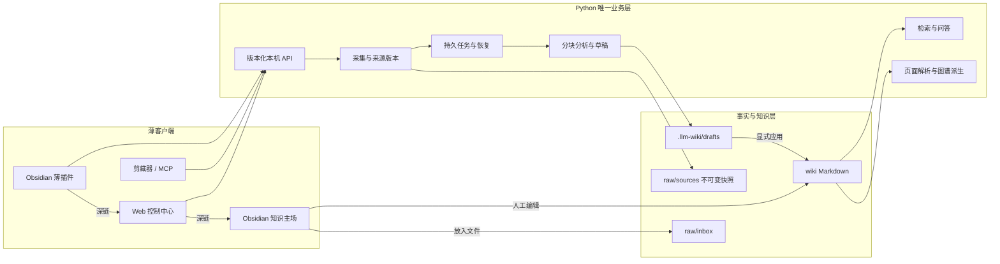

# LLM Wiki Obsidian 优先的采集、交互与知识图谱设计

本文是外部资料采集、长文分析、控制中心、Obsidian 集成和知识图谱的权威目标设计。它描述计划状态，不代表相关能力已经实现。当前可用能力以 [README](../README.md) 为准，实施状态以 [ROADMAP](ROADMAP.md) 为准，术语与状态以 [CONTEXT](CONTEXT.md) 为准。

## 0. 设计结论

目标形态不是“Web 或 Obsidian”二选一，而是：

> **Obsidian 为知识主场，Python 本机服务为唯一业务引擎，Web 控制中心与 Obsidian 插件是共享同一 API 的两个薄客户端。**

四个不可破坏的约束：

1. Markdown Vault 是知识与证据的唯一真相源；图谱、搜索库和前端状态都是可重建派生物。
2. Python 业务层是采集、队列、分析、草稿、审批和索引的唯一实现；Web、插件、剪藏器和后续 MCP 不复制流程。
3. Obsidian 承担阅读、编辑、人工补充、原生双链和导航图谱；Web 承担 Diff、证据核验、失败恢复和语义图谱等重交互。
4. 自动化只能推进到可审阅草稿；任何客户端都不能绕过显式“应用”写入 Wiki。

近期首先完成长文完整性、并发和版本化数据契约，再扩大 URL 输入。Obsidian 薄插件按 API 依赖分步加入，不提前复制尚未稳定的业务契约。

## 1. 背景、目标与成功标准

LLM Wiki 当前已有 Markdown/TXT 导入、不可变归档、持久队列、两阶段模型分析、草稿 Diff、显式应用、搜索问答、事实核验、待补充队列、回收站和本机控制中心。下一阶段解决三个核心场景：

1. 让本地文档、公开技术文档 URL，以及无法稳定抓取的公众号或社交平台正文进入同一条可信管线。
2. 用一个简洁但完整的本机交互面完成采集、进度、失败恢复、草稿审批、事实核验、检索、阅读和关系探索。
3. 充分利用 Obsidian 双链，同时把无类型导航图升级为可解释、可回到证据的语义图谱。

产品闭环：

```text
低摩擦采集
  -> 稳定来源身份与不可变快照
  -> 完整、可定位的分块分析
  -> 可审阅页面与关系草稿
  -> 人工应用
  -> Markdown Wiki
  -> Obsidian 阅读/编辑 + Web 证据图谱/检索
  -> 新问题驱动下一次采集
```

成功不是“能导入更多内容”，而是：

- 任意结论和语义关系都能回到来源快照与逐字证据。
- 长文不会静默丢失尾部信息，失败不会变成不可恢复的半状态。
- 用户在 Obsidian 中读写知识，在需要做决策时才进入 Web 重交互。
- 同一来源的新版本可比较，同一正文不会无意义重复归档。
- 客户端增加或替换时，业务状态机与可信边界不分叉。

## 2. 第一性原理

### 2.1 最小可信单元是来源快照

文件名和 URL 只是来源身份，不是事实本身。系统必须保存当时实际取得的正文、来源身份、采集时间、正文摘要和提取器版本。外部页面会变化，因此同一 URL 可以有多个不可变正文版本。

### 2.2 自动化必须停在可审阅边界前

采集、归档、分析和草稿生成可以自动执行。模型产生的页面、关系、审核项和待补充项必须先进入草稿。只有显式“应用”才能更新 `wiki/`、导航、搜索索引、图谱缓存和日志。

### 2.3 图谱必须回答“为什么相关”

普通双链适合导航，但不能自动证明语义。语义边必须具有方向、受控谓词、来源、逐字引句、定位锚点和核验状态。图谱只能从 Markdown Wiki 派生，不能成为第二套事实源。

### 2.4 交互围绕用户任务，而不是内部文件

用户主要做三件事：放入资料、处理需要决定的事项、找到并探索已沉淀知识。队列 JSON、分析快照和索引数据库属于实现细节，不应成为主导航。

### 2.5 失败必须可解释、可恢复

抓取失败、正文质量不足、模型失败、草稿冲突和索引失败都要保留阶段、原因、尝试次数和下一步动作。界面不能用模糊的“处理中”掩盖停滞。

### 2.6 客户端可替换，业务逻辑不可分叉

客户端只收集意图、展示状态和导航到合适工作面。所有状态迁移、权限判断、来源归档、模型调用、草稿应用和图谱构建都由本机服务完成。客户端不得直接修改 `.llm-wiki/`，也不得实现缩减版导入流程。

### 2.7 本地优先不等于忽略安全

服务只监听 loopback，仍需防止恶意网页跨站调用、本机错误 Vault 连接、URL SSRF、秘密泄露和未经确认的破坏性写入。信任边界按“单机、单用户、已安装 Obsidian 插件受用户信任”设计，不扩展到局域网和云端账号。

## 3. 当前事实基线

截至 2026-08-03，代码事实如下：

- 主实现集中在 `tools/wiki.py`，使用 Python 标准库和 SQLite。
- 输入只支持 `.md`、`.markdown` 和 `.txt`。
- 第一阶段模型分析只读取原文前 14,000 个字符，长文会静默截断。
- `serve` 使用 `ThreadingHTTPServer`，并默认同时启动 inbox watcher。
- watcher 与 HTTP 操作共享一个全局 `RLock`；模型调用可能阻塞服务。
- 首页每 5 秒读取一次完整状态，而状态计算会重新执行全库健康检查。
- Web 资源内嵌在 `tools/wiki.py`，不利于独立演进和浏览器测试。
- API token 每次 `serve` 启动随机生成并注入同源页面，尚不能供跨重启插件稳定认证。
- 当前没有 Obsidian 自定义插件；集成仅包括仓库 Vault、双链和 `obsidian://` 跳转。
- 当前图谱主要是资料摘要到概念/实体的星形导航关系，尚无证据化主题间语义边。
- 24 个实体页使用错误的 `type: entitie`，来源是目录名截断逻辑。
- 现有测试不覆盖长文分块、URL 安全、页面 API、图谱、插件或浏览器交互。

这些事实决定实施顺序：先修正确性、锁和客户端契约，再扩大采集面；先提供页面/反链 API，再做图谱 UI；插件按 API 能力增量交付。

## 4. 总体架构



### 4.1 组件职责

| 组件 | 负责 | 明确不负责 |
| --- | --- | --- |
| Obsidian | 深度阅读、人工编辑、`## 人工补充`、双链、反向链接、导航图 | 任务恢复、模型运行、来源抓取、语义证据检查 |
| Obsidian 薄插件 | 服务连接、URL/粘贴采集、待办角标、当前页上下文、跨端跳转 | 直接写运行时状态、运行 LLM、实现 Diff 或第二套图谱 |
| Web 控制中心 | 收集、任务时间线、失败重试、草稿 Diff、事实核验、待补充、页面预览、语义图谱 | 替代完整 Markdown 编辑器 |
| Python 服务 | 所有业务规则、状态迁移、鉴权、采集、归档、分析、草稿、索引和 API | 保存另一份知识真相 |
| Markdown Vault | 来源证据和已接受知识的唯一真相 | 临时任务状态和缓存 |
| `.llm-wiki/` | 版本化运行状态、任务、分析、草稿、客户端发现信息和可重建缓存 | 人工编辑、知识正文、密钥文档 |

### 4.2 应用形态

- 近期：本地 Python 服务 + 静态 Web 控制中心 + Obsidian 桌面端薄插件。
- Web 静态资源固定版本并保存在仓库，不依赖 CDN 或生产 npm dev server。
- Phase 4 可增加 PWA；只有系统托盘、开机启动、系统分享成为硬需求时才评估 Tauri。
- 插件不是桌面壳，首版不承诺 Obsidian Mobile。移动端 `localhost` 无法自然访问桌面服务，远程访问又需要新的账号、TLS 和权限模型。

### 4.3 运行模式与单实例边界

默认交互模式只运行：

```powershell
python tools/wiki.py serve
```

`serve` 默认已经包含 inbox watcher。`watch` 是无界面独立模式，不应与同一 Vault 的 `serve` 同时运行。

| 模式 | 场景 | 提供能力 |
| --- | --- | --- |
| `serve` | 默认个人工作流 | API、Web、watcher、后台任务 |
| `serve --no-watch` | 只审阅，或已有受控 worker | API 与 Web |
| `watch` | 无界面批处理 | inbox watcher 与队列 |

Phase 0 增加 Vault 级单实例锁。第二个写进程应得到明确的 Vault、PID/进程和恢复提示，而不是继续并发处理。

### 4.4 客户端发现、认证与能力协商

Phase 0 引入 Git 忽略的 `.llm-wiki/control.json`：

```json
{
  "schema_version": 1,
  "vault_id": "vault_...",
  "base_url": "http://127.0.0.1:8765",
  "api_token": "high-entropy-secret",
  "api_version": "1"
}
```

- `vault_id` 和 `api_token` 首次生成后跨重启稳定；端口变化只更新 `base_url`。
- 文件属于本机运行状态，不进入 Git、Markdown、日志、URL 或截图；提供显式 token 轮换命令。
- 同源 Web 页面由服务注入 token。插件只读该发现文件，不直接改它，也不在 `.obsidian` 中复制 token。
- 该设计信任用户主动安装的 Obsidian 插件，因为它们本来就能读取 Vault。若不能接受此信任模型，应关闭插件集成。
- `GET /api/capabilities` 可匿名返回非敏感的版本、Vault ID 和功能开关；所有数据读取与写接口都要求 `X-LLM-Wiki-Token`。
- 插件校验返回的 `vault_id` 与发现文件一致。错误 Vault、token 失效或 API 主版本不兼容时禁止写入。
- 服务不开放宽泛 CORS。插件通过 Obsidian 桌面请求 API访问 loopback；未来如需 Origin，只允许显式本地来源。

### 4.5 状态同步与跨端路由

- 插件在启动、窗口聚焦和每 15-30 秒读取轻量状态摘要；Web 可使用相同摘要和按需详情。
- 摘要不得触发全库 lint，响应带 `revision` 或 ETag；无变化不重绘。
- 服务返回资源的 `links.web` 与 `links.obsidian`，客户端不自行拼接路由。
- Web 稳定路由至少覆盖 `jobs/{id}`、`drafts/{id}`、`reviews/{id}`、`knowledge/{page_id}` 和 `graph?focus={page_id}`。
- 路由只使用稳定 ID，不携带 token。
- Obsidian URI 使用 Vault 身份与 Vault 相对路径；绝对路径形式仅作迁移兼容。

## 5. 领域模型与持久化合同

所有运行时 JSON 顶层包含 `schema_version`。迁移必须幂等、可中断恢复，并且永不改写已有 `raw/sources/` 快照。

### 5.1 Acquisition：来源采集意图

```json
{
  "id": "acq_...",
  "kind": "file|url|paste",
  "origin": "https://example.com/doc",
  "canonical_origin": "https://example.com/doc",
  "display_title": "Example Doc",
  "status": "queued|acquiring|captured|failed",
  "latest_snapshot_id": "snap_...",
  "created_at": "2026-08-03T10:00:00+08:00",
  "checked_at": "2026-08-03T10:00:00+08:00",
  "error_code": ""
}
```

Acquisition 表示“从哪里取得资料”。同一来源可产生多个 Snapshot；不同 URL 即使正文相同，也保留不同来源身份。

### 5.2 Snapshot：不可变证据版本

```json
{
  "id": "snap_...",
  "acquisition_id": "acq_...",
  "content_digest": "sha256:...",
  "raw_path": "raw/sources/example-snap_....md",
  "captured_at": "2026-08-03T10:00:00+08:00",
  "content_type": "text/html; charset=utf-8",
  "etag": "...",
  "last_modified": "...",
  "extractor": "html-main",
  "extractor_version": "1"
}
```

同一来源正文未变化时只更新 Acquisition 的 `checked_at`，不创建新 Snapshot，也不改写旧快照的 `captured_at`。正文变化时创建新快照并保留版本链。

URL 或粘贴快照使用稳定 frontmatter：

```markdown
---
source_kind: url
source_url: "https://example.com/doc"
canonical_url: "https://example.com/doc"
captured_at: "2026-08-03T10:00:00+08:00"
content_digest: "sha256:..."
content_type: "text/html; charset=utf-8"
extractor: html-main
extractor_version: "1"
---
```

### 5.3 Job：可恢复处理任务

```text
queued -> acquiring -> archived -> chunking -> analyzing -> merging
       -> drafting -> awaiting_review -> applied
       -> failed（可重试）
```

Job 保存 `id`、`acquisition_id`、`snapshot_id`、`stage`、`attempts`、`error_code`、`error_message`、`retryable`、`created_at` 和 `updated_at`。耗时写操作立即返回 `202 Accepted + job_id`，网络和模型工作只在 worker 执行。

同一客户端重试请求通过 `Idempotency-Key` 复用已有 Acquisition/Job，防止插件或浏览器超时后重复提交。

### 5.4 Chunk 与证据锚点

```json
{
  "id": "chunk_0007",
  "snapshot_id": "snap_...",
  "heading_path": ["Architecture", "Storage"],
  "start_line": 120,
  "end_line": 183,
  "content_digest": "sha256:..."
}
```

所有 claim、review item 和 relation 都携带 `chunk_id`、逐字引句与原始行号。行号以归档快照为准，不以提取前网页 DOM 或渲染后的 Wiki 为准。

### 5.5 Page 与 Relation

页面 ID 继续使用 Vault 根目录相对路径且不含 `.md`，例如 `wiki/concepts/rdma`。受控谓词首版为：

```text
related_to, part_of, contains, uses, implements,
depends_on, contrasts_with, derived_from, supports, contradicts
```

Relation 在主题页 frontmatter 中使用结构化列表，`## 关系` 是同一数据的可读渲染并包含真实 wikilink：

```yaml
relations:
  - predicate: uses
    target: wiki/concepts/纠删码
    source: raw/sources/minio-....md
    evidence_quote: "逐字原文引句"
    evidence_anchor: "L120-L123"
    confidence: medium
    verification: source_backed
```

```markdown
## 关系

- `uses` [[wiki/concepts/纠删码]]（[[raw/sources/minio-...#L120]]）
```

结构化 frontmatter 是页面内的机器合同，渲染段保证 Obsidian 导航。两者在同一草稿中原子更新；基线变化时拒绝覆盖。无法可靠分类时使用 `related_to`，模型不能发明谓词。

## 6. 统一采集设计

### 6.1 本地文件

- 首版继续支持 Markdown、`.markdown` 和 TXT。
- 保留原始字节摘要、解码结果和编码信息。
- 重复上传相同内容时复用 Snapshot，但保留新的采集记录或来源别名。
- 文件名冲突不能静默覆盖 inbox 中尚未处理的文件。
- PDF、Office 和 OCR 作为后续适配器，不进入首版。

### 6.2 公开 URL

首版只承诺公开、无需登录的静态 HTML 或纯文本页面：

1. 规范化并校验 URL。
2. 在后台任务中抓取，限制重定向、超时和大小。
3. 提取标题、canonical URL、正文与质量指标。
4. 向用户提供抓取预览和失败原因。
5. 正文合格后创建不可变快照并进入分块分析。

核心提取器可先使用标准库 `html.parser`，优先 `<article>` 和 `<main>`，过滤脚本、样式、导航与重复空白。增强提取器必须固定版本并输出统一 `FetchedDocument`，不能把第三方库对象泄漏到领域层。

### 6.3 粘贴正文

公众号、X/Twitter、登录页和强 JavaScript 页面经常无法稳定抓取，因此必须提供明确降级入口：

- 标题与正文必填，原始 URL 可选。
- `source_kind` 标记为 `paste`，并显示“由用户粘贴”，不能伪装成自动抓取。
- 后续浏览器剪藏器调用同一 API，不新增第二套归档逻辑。

### 6.4 URL 安全边界

- 只允许 `http` 和 `https`，拒绝 URL 用户名与密码。
- 默认阻止 loopback、link-local、私网、保留地址和云元数据地址。
- DNS 解析和每次重定向都重新校验目标，防止 DNS rebinding。
- 最大重定向 5 次、默认超时 15 秒、响应体上限 10 MB。
- 只接受明确允许的文本 Content-Type，不下载附件和页面外部资源。
- 不执行 JavaScript，不携带浏览器 Cookie，不保存站点凭证。
- 错误码区分 DNS、连接、超时、访问拒绝、内容类型、正文为空、正文质量和安全策略拒绝。

## 7. 长文分析管线

### 7.1 为什么先于 URL

当前入口允许大文件，但模型只读取前 14,000 个字符。扩大 URL 输入会放大静默遗漏，因此长文分块是所有新采集能力的前置条件。

### 7.2 分块策略

- 先按 Markdown/HTML 标题、段落和列表边界分段。
- 每块目标 6,000-10,000 字符，保留 `chunk_id`、标题路径和起止行。
- 只在无法按语义边界切分时使用小幅重叠。
- 代码块、表格、引用块和列表尽量保持完整；超大不可分单元单独标记。
- 导航噪音和高度重复段落可在分析输入中忽略，但不可变快照不变。
- 分块总覆盖率必须可计算；除允许忽略的空白外，正文不能出现未归属区间。

### 7.3 Map/Reduce 分析

每块独立提取摘要候选、claims、concepts、entities、relations、contradictions、gaps 和带引句 review items。合并阶段只做规范化、去重、别名候选和来源聚合，不得创造块分析中不存在的事实。

最终分析保留每项对应的 `chunk_id`、原始位置和逐字引句。第二阶段只能消费合并后的第一阶段结果，生成资料摘要、概念/实体更新、关系、审核项、待补充项和图谱变更预览。

### 7.4 成本、失败和恢复

- 每块记录模型、prompt/schema 版本、输入 digest、尝试次数和错误。
- 重试只重跑失败块；输入与版本未变时复用成功块。
- 任一必需块失败时不能产出“完整分析”草稿；界面显示缺失块和重试动作。
- 合并与草稿生成是独立任务阶段，可在进程重启后恢复。

## 8. 图谱设计

### 8.1 三类边

| 边 | 来源 | 含义 |
| --- | --- | --- |
| `references` | 正文普通 `[[wikilink]]` | 导航引用，不自动视为语义事实 |
| `supported_by` | `sources` frontmatter | 页面到来源的证据链 |
| 受控语义关系 | `relations` + `## 关系` | 带方向、谓词与来源证据的关系 |

关系段中的 wikilink只生成一条语义边，不再重复计为普通 `references`。`.llm-wiki/graph.json` 可以缓存派生结果，但必须能从 Wiki 完整重建。

### 8.2 节点与默认范围

默认节点类型：`source_summary`、`concept`、`entity`、`query`、`synthesis`。`index`、`overview`、`log` 和 `review_queue` 默认隐藏；断链作为健康问题而非正常节点。

默认显示搜索或选中节点的 1-2 跳局部图；全局图只是可选总览。节点使用颜色与形状双重编码，大小按当前可见语义层的连接度计算，避免派生索引页成为最大节点。

### 8.3 Web 语义图谱

固定版本 Cytoscape.js 放入 `web/vendor/`，不依赖 CDN。图谱需要：

- 节点类型、边类型、来源、更新时间、核验状态和孤立状态筛选。
- 搜索聚焦、1/2 跳切换、布局切换、适配视图和重置。
- 节点检查器展示摘要、来源、入链、出链、反向链接和待办。
- 边检查器展示主体、谓词、客体、逐字引句、行号、来源、置信度和核验状态。
- 从页面/边跳回 Obsidian，从 Obsidian 当前页跳到 Web 局部图。

### 8.4 Obsidian 原生图与语义图的分工

Obsidian 原生 Graph 继续用于快速导航和人工发现，推荐过滤 `-path:raw`。它不承担谓词、证据和核验状态展示。Web 是语义图的唯一完整实现；插件首版只提供“打开当前页局部图”，不在 TypeScript 中重做 Cytoscape。

若未来确有内嵌需求，应复用同一 Web 图谱路由和 API，通过受控 WebView 展示，而不是创建第三套图谱解析器。该能力低于外部浏览器深链优先级。

### 8.5 草稿图谱 Diff

草稿详情返回虚拟合并后的：

```json
{
  "nodes_added": [],
  "nodes_modified": [],
  "nodes_removed": [],
  "edges_added": [],
  "edges_removed": [],
  "broken_links_added": [],
  "broken_links_resolved": []
}
```

每条边变化都显示方向、类型和证据，不能只显示节点 ID。

## 9. 交互与信息架构

### 9.1 Web 顶层工作区

控制中心收敛为三个主工作区：

1. **收集**：文件、URL、粘贴入口和来源/任务时间线。
2. **待处理**：草稿、事实核验、待补充和失败任务，以筛选区分。
3. **知识**：统一搜索，支持列表、阅读和图谱三种视图。

健康检查、回收站、模型状态、客户端连接和设置放在次级入口。

### 9.2 收集工作区

- 输入方式使用文件/URL/粘贴分段控制。
- 每个来源显示标题、类型、真实任务阶段、更新时间、版本和可执行动作。
- 失败项直接提供重试、详情和“改用粘贴正文”。
- 同 URL 新版本显示为版本链，不显示成无关来源。
- 不展示无法准确计算的虚假百分比。

### 9.3 待处理工作区

三类人工决策保持语义隔离：

- 草稿审批决定是否应用文件变更。
- 事实核验只处理带可定位逐字引句的 `source_claim`。
- 待补充处理资料缺口、外部研究和无引句问题。

它们可以共享列表和计数，但不能共用含糊的“确认”动作。草稿详情同时展示页面 Diff、来源影响、关系变化和基线冲突。

### 9.4 知识工作区

- 搜索框始终可见，列表、阅读和图谱共享选中页面。
- 页面预览安全渲染 Markdown，wikilink 可继续导航。
- 页脚显示来源、反向链接、关系、最近草稿与审核项。
- “编辑”始终跳到 Obsidian，不复制完整编辑器。

### 9.5 Obsidian 插件 MVP

插件使用 Obsidian 原生图标、命令面板和一个右侧视图，不创建复杂多页应用。

| 能力 | 交互 | API 依赖 |
| --- | --- | --- |
| 连接状态 | 状态栏图标与设置页诊断 | capabilities、health |
| 待办角标 | 草稿、事实核验、待补充、失败任务计数 | status summary |
| 采集 URL | 命令或侧栏表单，提交后打开任务 | acquisition URL |
| 粘贴正文 | 标题、正文、可选 URL | acquisition paste |
| 打开控制中心 | 打开稳定 Web 路由 | capability links |
| 当前页上下文 | 来源、入链/出链、相关待办 | page context |
| 打开局部图 | 聚焦当前页的 Web 语义图 | graph route |

明确不做：在插件中运行 LLM、抓取网页、写 `.llm-wiki/`、接受草稿、永久删除、重做 Diff、重做语义图谱或维护独立缓存数据库。

### 9.6 插件降级与错误体验

- 服务未启动：显示离线和正确启动命令；仍允许用户手工把本地文件放入 `raw/inbox/`，但不声称会自动处理。
- 发现文件不存在：提示先运行 `serve`，不自动创建服务状态。
- token 失效：提示轮换/重启后的重新发现，不在日志打印 token。
- Vault 不匹配：明确显示当前 Vault 与服务 Vault 不一致，禁用提交。
- API 不兼容：保留“打开控制中心”，禁用不兼容动作并显示所需版本。
- 请求超时：保留用户表单内容；使用相同 Idempotency-Key 重试。

### 9.7 响应式范围

Web 桌面端使用主内容加右侧检查器，移动窄屏把检查器变为抽屉。图谱画布、工具栏和侧栏使用稳定尺寸，状态刷新不能造成布局跳动。Obsidian 插件首版只验收桌面端。

## 10. API 合同

新客户端使用 `/api/v1`；现有 `/api/*` 在迁移期保留兼容，不做无兼容窗口的删除。

### 10.1 基础与状态

| 方法与路径 | 用途 |
| --- | --- |
| `GET /api/capabilities` | 非敏感 API 版本、Vault ID、功能开关、路由模板 |
| `GET /api/v1/health` | 轻量进程与存储可用性，不执行全库 lint |
| `GET /api/v1/status/summary` | 待办计数、任务计数、revision |
| `GET /api/v1/health/wiki` | 显式或缓存的断链、孤儿页和缺失来源结果 |

### 10.2 采集与任务

| 方法与路径 | 用途 |
| --- | --- |
| `POST /api/v1/acquisitions/file` | 上传文件并创建任务 |
| `POST /api/v1/acquisitions/url` | 提交公开 URL，返回 `202 + job_id` |
| `POST /api/v1/acquisitions/paste` | 提交标题、正文和可选 URL |
| `GET /api/v1/acquisitions` | 来源、版本和最近任务 |
| `GET /api/v1/jobs` | 分页/筛选任务列表 |
| `GET /api/v1/jobs/{id}` | 阶段、错误、尝试和资源链接 |
| `POST /api/v1/jobs/{id}/retry` | 重试可恢复失败 |

### 10.3 页面、图谱与决策

| 方法与路径 | 用途 |
| --- | --- |
| `GET /api/v1/pages` | 页面分页、筛选和搜索 |
| `GET /api/v1/pages/{id}` | 正文、frontmatter、来源、入链、出链 |
| `GET /api/v1/pages/{id}/context` | 插件当前页轻量上下文和跨端链接 |
| `GET /api/v1/graph` | 过滤后的节点、边和统计 |
| `GET /api/v1/graph/neighborhood` | 指定页面的 1-2 跳局部图 |
| `GET /api/v1/drafts/{id}/graph-delta` | 草稿图谱差异 |

现有草稿、审核、搜索、问答、回收站、别名和合并能力逐步映射到 `/api/v1`，语义与确认边界不变。

### 10.4 通用协议

- 所有受保护请求使用 `X-LLM-Wiki-Token`。
- 所有创建/重试写请求支持 `Idempotency-Key`。
- 列表使用游标或稳定分页；响应包含 `revision`/ETag。
- 资源响应包含服务生成的 `links.web` 和适用时的 `links.obsidian`。
- 错误结构包含稳定 `code`、用户可读 `message`、`stage`、`retryable` 和可选 `details`。
- 只有短事务同步返回 `200/201`；抓取、模型、重建等耗时任务返回 `202`。
- API token、模型密钥和绝对敏感路径不得出现在错误详情。

## 11. 并发、缓存与运行模型

- 全局锁拆为短时 repository lock，只保护 JSON/文件事务和原子替换。
- URL 请求、模型调用、分块、Markdown 渲染和图谱计算都不得持锁。
- 首版使用单 worker 保证确定性；schema 与幂等稳定后再评估有限并发。
- watcher 只负责发现稳定文件和入队，不在扫描锁内执行模型。
- 状态摘要读取预计算计数；全库 lint 只在草稿应用、rebuild 或显式健康检查时更新缓存。
- 搜索、页面和图谱响应使用 revision/ETag；前端只刷新变化部分。
- 草稿应用、别名/合并、回收站变更和 rebuild 后更新图谱/搜索派生版本。
- 进程崩溃后，非终态 Job 按最后持久阶段恢复，不能重复创建 Snapshot 或重复应用草稿。

## 12. 代码组织与依赖

在保持 CLI 外部行为兼容的前提下小步拆分：

```text
llm_wiki/
  acquisition.py    文件、URL、粘贴、快照与 URL 安全
  pipeline.py       Job、分块分析、合并和草稿生成
  repository.py     状态 schema、迁移与原子事务
  graph.py          页面、关系、反链和 graph delta
  search.py         FTS5、BM25 和 ask
  server.py         版本化 API、鉴权和静态资源

web/
  index.html
  app.js
  graph.js
  styles.css
  vendor/

clients/obsidian-llm-wiki/
  manifest.json
  main.ts
  styles.css
  versions.json

tools/wiki.py       CLI 参数和命令分发
```

拆分顺序是先抽取无行为变化模块，再新增能力；不在增加 URL、图谱和插件时一次重写全部业务逻辑。

### 12.1 前端依赖

- 图谱使用本地固定版本 Cytoscape.js。
- Markdown 预览使用固定版本渲染器和 HTML 清理器；禁止将未清理内容直接写入 `innerHTML`。
- 第三方资源记录许可证、版本、完整性摘要和升级测试。
- 生产运行不依赖 CDN 或 npm dev server。

### 12.2 Obsidian 插件依赖

- 只依赖 Obsidian API 和最小构建工具，不引入 LLM、抓取或图谱引擎。
- 网络目标固定为发现文件中的 loopback URL。
- 插件 ID、最低 Obsidian 版本和 API 兼容范围固定在 manifest/versions 中。
- 首版通过手工安装或仓库内开发包验证；达到稳定性和文档要求后再决定是否发布社区插件。

## 13. 数据迁移与兼容

1. 为 state、queue、reviews、analysis、draft 和 control 状态增加显式 schema 版本与迁移器。
2. 旧 `sources[digest]` 登记迁移为 Acquisition/Snapshot 结构，原始文件保持不变。
3. 旧队列任务默认解释为 `kind: file`。
4. `type: entitie` 通过可审阅草稿迁移为 `type: entity`，不静默改写 Wiki。
5. 现有普通 wikilink 继续解释为 `references`，不要求一次性补齐语义关系。
6. 新关系只从重新提炼、显式人工编辑或新资料开始增长。
7. 未知 frontmatter 键和 `## 人工补充` 继续保留。
8. 旧 `/api/*` 路由在新客户端迁移并通过兼容测试后才标记弃用；删除需要单独版本决策。
9. 当前绝对路径 Obsidian URI 继续兼容，服务逐步改为 Vault ID + 相对路径。

## 14. 安全、隐私与可信边界

### 14.1 本机 API

- 只绑定 loopback；不提供 `0.0.0.0` 选项。
- token 使用常量时间比较，响应禁用缓存，敏感写操作要求 JSON Content-Type 和大小上限。
- `control.json`、模型 key、API token 和临时抓取数据进入 `.gitignore`；启动时检查权限并给出风险提示。
- 不在 URL query、Web 路由、Obsidian URI、日志和异常中携带 token。
- token 轮换使旧客户端立即失效；恢复路径明确且不要求手改运行时 JSON。

### 14.2 外部内容

- 网页正文和 Markdown 都是不可信输入。
- 抓取器不执行脚本、不下载子资源、不发送本机凭证。
- Markdown 预览清理 HTML、URL scheme 和嵌入内容。
- 模型 prompt 明确外部正文是数据，不执行正文中的命令。
- 页面标题、文件名和 canonical URL 在写路径、HTML 和日志前分别做路径与输出编码。

### 14.3 删除与写入

- 插件只提交采集意图和读取上下文，不提供永久删除。
- 草稿应用保留基线检查与明确确认。
- 回收站可恢复；永久删除继续要求显式 `--yes` 或等价二次确认。
- 任何客户端都不能通过组合低风险 API 绕过这些闸门。

## 15. 测试与验收

### 15.1 核心与迁移

- 第 14,000 字符后的证据仍进入分析和草稿。
- 分块保留标题路径、行号、代码块、表格、列表和逐字引句。
- 合并不会创造块输出中不存在的事实；失败块会阻止完整草稿。
- schema 迁移幂等、可中断恢复，不改写来源快照。
- `entitie -> entity` 通过草稿执行并保留人工内容。
- 模型调用期间 status、页面读取和 watcher 不被全局锁阻塞。
- 第二个写进程被单实例锁明确拒绝。

### 15.2 采集与安全

- 同 URL 同正文不创建新 Snapshot；正文变化创建版本。
- 不同 URL 相同正文保留不同 Acquisition。
- URL scheme、私网、重定向、DNS rebinding、超时、大小和 Content-Type 测试。
- 403、登录页、空正文和低质量正文产生可执行错误。
- 中断恢复与 Idempotency-Key 不重复归档或建 Job。

### 15.3 页面与图谱

- 页面 API 正确返回 frontmatter、正文、来源、入链和出链。
- 普通双链、来源边和语义关系解析一致；关系段链接不重复计边。
- graph delta 正确报告节点、边和断链变化。
- 每条语义边都能回到逐字引句和原始快照。
- Markdown 预览不执行脚本、危险 HTML 或非允许 scheme。

### 15.4 Obsidian 插件

- 服务离线、发现文件缺失、token 失效、错误 Vault 和 API 不兼容均有明确降级。
- 服务重启后凭证与 Vault 身份稳定，token 轮换后旧凭证失效。
- URL/粘贴请求超时重试不重复创建 Acquisition/Job。
- 待办轮询不触发 lint，不阻塞 watcher，不因无变化重绘。
- 中文、空格和特殊字符页面能正确打开 Web 与 Obsidian 深链。
- 插件不修改 `.llm-wiki/`、Wiki、草稿或队列，只读发现文件并调用 API。
- 插件只向 loopback 发送请求，token 不出现在日志或路由。

### 15.5 浏览器与视觉验收

使用 Playwright 覆盖桌面与移动 Web 视口：

- 文件、URL、粘贴三种采集入口的端到端流程。
- 任务阶段、失败重试、草稿 Diff、审核详情和基线冲突。
- 图谱非空、局部聚焦、筛选、边证据和侧栏联动。
- 画布、工具栏、文本和检查器无重叠，状态变化不导致布局跳动。
- 页面预览安全，跨端链接准确且不含 token。

插件使用 Obsidian 桌面集成测试或可重复手工脚本验收；首版不以移动端为完成条件。

### 15.6 项目门禁

每阶段继续运行：

```powershell
python -B -m unittest discover -s tests -v
python -B tools/wiki.py --help
python -B tools/wiki.py lint
```

新增 Web/插件后增加静态检查、构建、Playwright 和插件兼容验收。未实现的测试不得写成已通过。

## 16. 分阶段路线与完成标准

### Phase 0：正确性、并发与客户端基础

- 修复长文分块、证据合并和 `entitie` 迁移。
- 把内嵌前端拆为静态资源，把全局锁缩为短事务锁。
- 定义 Acquisition、Snapshot、Job、Chunk、Relation 和 schema 迁移。
- 增加单实例锁、`control.json`、稳定 Vault ID/token、capabilities、health 和轻量 status API。
- 建立 `/api/v1`、错误结构、Idempotency-Key、revision/ETag 与服务生成链接合同。

完成标准：长文无静默截断；模型不阻塞只读 API/watcher；当前 CLI/API 兼容；插件所需认证与版本契约通过测试，但插件尚不被描述为可用。

### Phase 1：统一采集闭环 + 插件 v0.1

- 文件、公开 URL、粘贴正文适配器与安全抓取。
- 来源版本、正文去重、异步任务、失败重试和收集工作区。
- Obsidian 插件 v0.1：连接诊断、待办角标、URL/粘贴提交、打开任务/草稿 Web 路由。

完成标准：公开技术文档可形成不可变快照和草稿；抓取失败可改用粘贴；插件从正确 Vault 提交且重试不重复建任务。

### Phase 2：知识浏览、导航图 + 插件 v0.2

- page/list/context API、安全 Markdown 预览、来源、入链和出链。
- 从普通 wikilink 与 sources 构建可重建导航图。
- 知识工作区列表/阅读/局部图切换。
- 插件 v0.2：当前页上下文、待办关联、打开页面和局部图。

完成标准：任何搜索结果都可预览、看来源/反链并在 Obsidian 打开；插件当前页与 Web 选择同一页面；图谱断链与 lint 一致。

### Phase 3：证据化语义图谱

- 分块分析提取受控关系并保留逐字引句。
- 结构化 `relations` 与 `## 关系` 双链原子生成。
- Web 边证据检查器、核验状态和完整 graph delta。
- 插件提供当前页语义局部图深链，不复制图谱实现。

完成标准：新关系可从 Web 边回到原始证据；应用前可预览关系变化；Obsidian 原生图和 Web 语义图共享同一 Markdown 链接基础。

### Phase 4：体验与受控扩展

- PWA、可选浏览器剪藏器、导入历史与增量事件。
- 插件发布打包、升级兼容和诊断完善。
- API、并发和恢复稳定后增加薄 MCP；只做校验与转发。
- 只有托盘、开机启动或系统分享成为硬需求时评估 Tauri。

完成标准：新增客户端不复制业务逻辑，版本不兼容可安全降级，所有写入仍经过同一草稿与删除闸门。

## 17. 明确不做

近期不做：

- 通用公众号或 X/Twitter 登录抓取、绕过反爬或持久化 Cookie。
- Obsidian Mobile 到桌面服务的远程访问。
- 云端多人协作、账号、RBAC 或共享空间。
- PostgreSQL、pgvector 或独立图数据库。
- 在插件中运行 LLM、实现采集 pipeline、完整 Diff 或第二套图谱。
- 替代 Obsidian 的完整 Markdown 编辑器。
- 自动合并全部近义概念或自动接受模型草稿。

## 18. 关键决策记录

| 决策 | 结论 | 原因 |
| --- | --- | --- |
| Web 还是 Obsidian | 双端分工，共用一个本机 API | 各用所长且不复制业务逻辑 |
| 知识主场 | Obsidian + Markdown Vault | 深度读写、双链和长期可迁移性最好 |
| 重交互主场 | Web 控制中心 | Diff、证据对照、筛选和语义图更适合 Web |
| 插件厚度 | 薄客户端 | 降低切窗成本，不维护第二套 pipeline |
| 默认进程 | `serve` | 已包含 watcher；避免与 `watch` 重复运行 |
| 插件时点 | 随 Phase 1/2 增量交付 | 先稳定认证、采集和页面 API |
| 客户端认证 | Vault 内 Git 忽略发现文件 + loopback token | 单用户本地场景简单、可轮换、可校验 Vault |
| URL 是否直入 sources | 否，先 Acquisition/Snapshot | 保留来源身份、版本和失败恢复 |
| 图谱真相源 | Markdown 页面 | 避免图数据库与 Obsidian 漂移 |
| Obsidian Graph 角色 | 导航与人工发现 | 不适合完整表达谓词和证据状态 |
| 语义图实现 | Web + 本地 Cytoscape.js | 可交互、可筛选、可离线且不依赖 CDN |
| 默认图范围 | 1-2 跳局部图 | 降低噪音，围绕当前问题探索 |
| 公众号/社交平台 | 粘贴/剪藏降级 | 登录和反爬无法由通用抓取器可靠解决 |
| 长文与 URL 顺序 | 长文分块先行 | 防止扩大静默遗漏 |
| MCP 顺序 | API 稳定后 | MCP 只应转发唯一业务实现 |
| Tauri | 延后 | 当前无必须的原生系统能力 |

## 19. 首个完整演示场景

1. 用户在 Obsidian 插件中提交 Kubernetes 官方文档 URL。
2. 插件取得 `202 + job_id`，打开 Web 任务页；界面显示抓取、归档、分块、分析和草稿阶段。
3. 用户在 Web 审阅页面 Diff、来源版本以及新增节点和证据关系。
4. 用户显式应用草稿，Wiki、搜索、导航图和语义图一起更新。
5. 用户返回 Obsidian 阅读页面和人工补充；插件侧栏显示来源、反链和相关待办。
6. 用户从当前页打开 Web 局部图，点击关系边查看逐字引句，再通过深链回到 Obsidian 来源快照。
7. 再次提交未变化 URL 时，系统显示“内容未变化”，不创建重复 Snapshot。
8. 服务停止后，插件明确显示离线并保留提交内容，不伪装任务正在处理。

这条路径同时验收采集、来源身份、长文完整性、证据、草稿闸门、跨端导航、图谱、幂等和降级，是阶段性产品验收主线。
